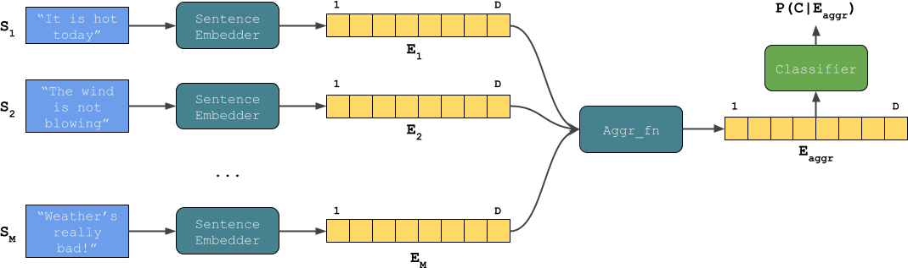

# Document-Subjectivity

  

Document subjectivity classification using a small Italian newspapers articles dataset called [SubjectivITA](https://github.com/francescoantici/SubjectivITA). The dataset is composed of 74 training documents  containing  1614  sentences  in  total,  and  29  testing  documents, containing 227 sentences. 

In order to deal with small data limitation, [sBERT](https://sbert.net/), a library containing pretrained, multi-language sentence embedding models can be employed. 

Using these pretrained models, one can easily produce meaningful representations for individual sentences, which in their turn can be used as features for simpler classical machine learning models to predict the document class.